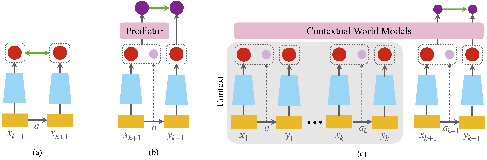
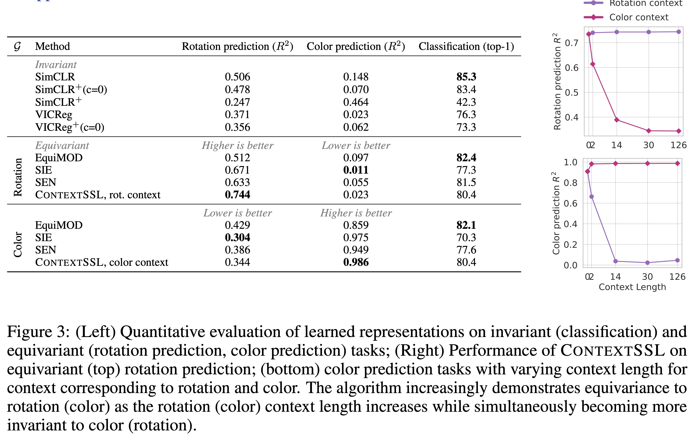
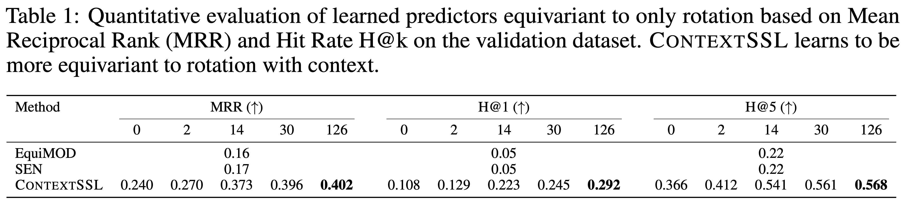

# Self-Supervised Learning through Contextual World Models

By Sharut Gupta*, Chenyu Wang*, Yifei Wang*, Tommi Jaakkola, Stefanie Jegelka.  

[[pdf](https://openreview.net/pdf?id=etPAH4xSUn)]


At the core of self-supervised learning for vision is the idea of learning invariant or equivariant representations with respect to a set of data transformations. This approach, however, introduces strong inductive biases, which can render the representations fragile in downstream tasks that do not conform to these symmetries. In this work, drawing insights from world models, we propose to instead learn a general representation that can adapt to be invariant or equivariant to different transformations by paying attention to context --- a memory module that tracks task-specific states, actions and future states. Here, the action is the transformation, while the current and future states respectively represent the input's representation before and after the transformation. Our proposed algorithm, **Context**ual **S**elf **S**upervised **L**earning (**ContextSSL**), learns equivariance to all transformations (as opposed to invariance). In this way, the model can learn to encode all relevant features as general representations while having the versatility to tail down to task-wise symmetries when given a few examples as the context. Empirically, we demonstrate significant performance gains over existing methods on equivariance-related tasks, supported by both qualitative and quantitative evaluations.


<p align='center'>

</p>


The key contributions of this work include: 
- We propose ContextSSL, a self-supervised learning algorithm that adapts to task-specific symmetries by paying attention to context. Our method resolves the long-standing challenge of enforcing fixed invariances and equivariances to handcrafted data augmentations, enabling adaptive and task-sensitive representations without parameter updates.
- We show that learning with context is prone to identifying shortcuts and subsequently propose two key modules to address it: a context mask and an auxiliary predictor.
- We demonstrate the efficacy of our approach on MIMIC-III, UCI Adult, 3DIEBench and CIFAR10, showing its ability to selectively learn invariance or equivariance to naturally occurring features and sensitive attributes such as gender and transformations such as color and rotation while maintaining similar performance on invariant benchmarks. 


## ContextSSL: Contextual Self-Supervised Learning

### Prerequisites
The code has the following package dependencies:
- Pytorch >= 2.0.0 
- Torchvision >=  0.12.0 
- Other Packages: Any additional packages required (e.g., numpy, matplotlib, etc.) are in requirements.txt (or can be easily installed via pip/conda).

```
pip install -r requirements.txt
```
- 3DIEBench Dataset: After installing these dependencies, install 3DIEBench dataset from https://dl.fbaipublicfiles.com/SIE/3DIEBench.tar.gz. More information about the dataset is available at https://github.com/facebookresearch/SIE/tree/main/data. Make sure to update the dataset path in `config.yml` to point to where you extracted 3DIEBench.


### ContextSSL Training 
While we conducted experiments on 3DIEBench, CIFAR10, MIMIC-III, and UCI Adult, we are only providing the code for 3DIEBench at this time. However, the method is dataset-agnostic, and you can adapt it to other datasets by replacing or adjusting the dataset files as needed.

To train a representation with ContextSSL using a ResNet18 backbone on 3DIEBench dataset, run the following command:

```
CUDA_VISIBLE_DEVICES=3 python main.py \
    backbone=resnet18 \
    epochs=1000 \
    n_layer=3 \
    block_size=128 \
    log_interval=5 \
    projection_dim=512 \
    learning_rate=5e-5 \
    temperature=0.1 \
    weight_equiv_loss=5.0 \
    env_ratio=[0.5,0.5,0.0] \
    eval_normalize=True \
    random_mask=True \
    mask_prob=0.9 \
    weight_decay=1e-3
``` 
This command reflects the best-performing hyperparameter settings used in our experiments, corresponding to the optimal results reported in the paper. Further, training with the provided configuration requires only about 10 GB of GPU memory, making it feasible to train on a single standard NVIDIA GPUs (e.g., an RTX 2080, V100, A100, A6000 etc). Training under this configuration for a 1000 epochs takes about 7-8 hours on one NVIDIA A6000. 

### ContextSSL Evaluation
To quantitatively evaluate the trained representation’s equivariance to symmetry groups, we compute $R^2$ on the task of predicting the corresponding transformation parameters. Use the following command to run the evaluation:

```
CUDA_VISIBLE_DEVICES=3 python eval_equivariance.py \
    seed=42 \
    log_interval=50 \
    eval_ctxt=[0,2,6,14,30,126] \ 
    epochs=200 \
    learning_rate=0.001 \
    load_model=simclr_resnet18_epoch1000.pt \
    pretrained_model_dir=./ckpt/
```


To quantitatively evaluate the trained representation’s equivariance to rotation, we compute the Mean Reciprocal Rank (MRR) and Hit Rate H@k on the validation set, as reported in [Table 1](https://openreview.net/pdf?id=etPAH4xSUn#page=8.10) of the paper. Use the following command to run the evaluation:

```
CUDA_VISIBLE_DEVICES=3 python eval_MRR_Hk.py \
    seed=42 \
    log_interval=50 \
    eval_ctxt=[0,2,6,14,30,126] \ 
    epochs=300 \
    load_model=simclr_resnet18_epoch1000.pt \
    pretrained_model_dir=./ckpt/
```

To calculate the linear probe preformance of both the feature representation (before transformer predictor) and that after the predictor embeddings:

```
CUDA_VISIBLE_DEVICES=3 python linear_probe.py \
    seed=42 \
    log_interval=50 \
    eval_ctxt=[0,2,6,14,30,126] \ 
    epochs=300 \
    load_model=simclr_resnet18_epoch1000.pt \
    pretrained_model_dir=./ckpt/
```
In order to modify the linear probe model’s configuration, edit the parameters in `eval_config.yml`.

### Pretrained Model Weights
We also provide [pretrained model weights](https://drive.google.com/drive/folders/1_nM7RxKQtGKWZXQHavQRBGu1jocGndfz?usp=sharing) that you can directly load for evaluation or fine-tuning. Simply download the weights to `./ckpt/` and specify the path to the provided model checkpoint in your evaluation script (as in the above command), and the code will handle the rest.


<p align='center'>

</p>


<p align='center'>

</p>


### Citation
If you find this code or the ContextSSL approach useful in your research, please consider citing:

```bibtex
@inproceedings{gupta2023contextssl,
  title={Self-Supervised Learning through Contextual World Models},
  author={Gupta, Sharut and Wang, Chenyu and Wang, Yifei and Jaakkola, Tommi and Jegelka, Stefanie},
  journal={The Thirty-eighth Annual Conference on Neural Information Processing Systems},
  year={2024}
}
```


