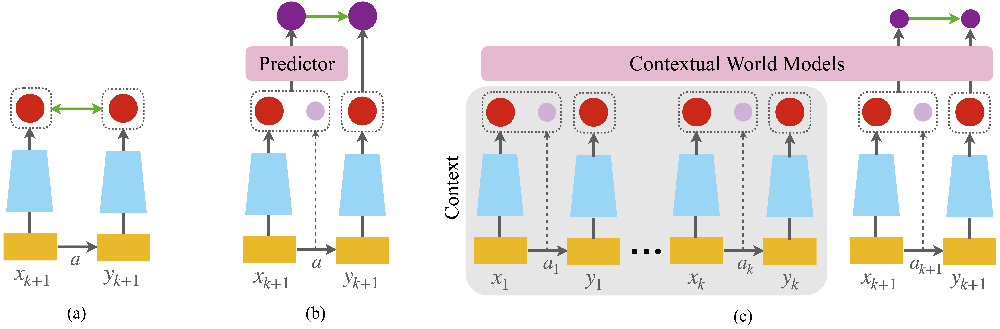

# Self-Supervised Learning through Contextual World Models

By Sharut Gupta*, Chenyu Wang*, Yifei Wang*, Tommi Jaakkola, Stefanie Jegelka.  

[[pdf](https://openreview.net/pdf?id=etPAH4xSUn)]

At the core of self-supervised learning for vision is the idea of learning invariant or equivariant representations with respect to a set of data transformations. This approach, however, introduces strong inductive biases, which can render the representations fragile in downstream tasks that do not conform to these symmetries. In this work, drawing insights from world models, we propose to instead learn a general representation that can adapt to be invariant or equivariant to different transformations by paying attention to context --- a memory module that tracks task-specific states, actions and future states. Here, the action is the transformation, while the current and future states respectively represent the input's representation before and after the transformation. Our proposed algorithm, **Context**ual **S**elf **S**upervised **L**earning (**ContextSSL**), learns equivariance to all transformations (as opposed to invariance). In this way, the model can learn to encode all relevant features as general representations while having the versatility to tail down to task-wise symmetries when given a few examples as the context. Empirically, we demonstrate significant performance gains over existing methods on equivariance-related tasks, supported by both qualitative and quantitative evaluations.

The key contributions of this work include: 
- We propose ContextSSL, a self-supervised learning algorithm that adapts to task-specific symmetries by paying attention to context. Our method resolves the long-standing challenge of enforcing fixed invariances and equivariances to handcrafted data augmentations, enabling adaptive and task-sensitive representations without parameter updates.
- We show that learning with context is prone to identifying shortcuts and subsequently propose two key modules to address it: a context mask and an auxiliary predictor.
- We demonstrate the efficacy of our approach on MIMIC-III, UCI Adult, 3DIEBench and CIFAR10, showing its ability to selectively learn invariance or equivariance to naturally occurring features and sensitive attributes such as gender and transformations such as color and rotation while maintaining similar performance on invariant benchmarks. 

## ContextSSL: Contextual Self-Supervised Learning

### Prerequisites
The code has the following package dependencies:
- Pytorch >= 2.0.0 
- Torchvision >=  0.12.0 

